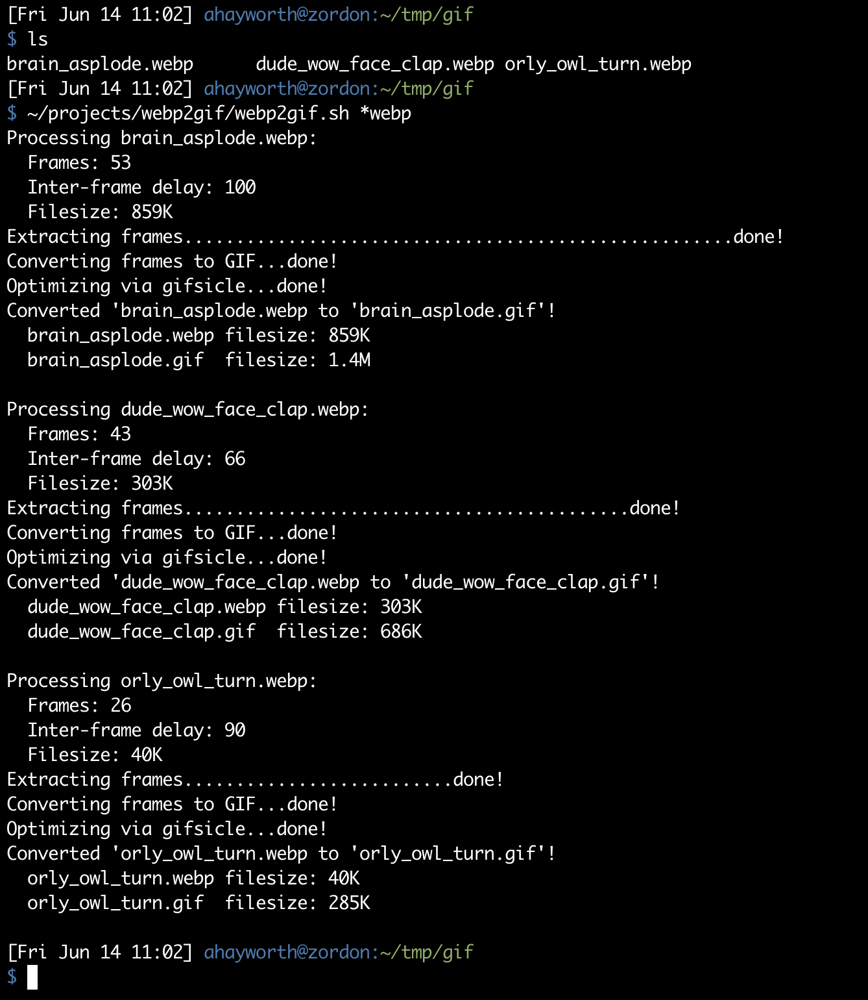

# gifscripts

A small collection of hand-crafted bash scripts that feed my animated GIF addiction:

* [webp2gif](#webp2gif) Script to convert animated webp files to looping, animated gifs.  Will try to optimize filesize via [gifsicle](https://www.lcdf.org/gifsicle/) if it's installed.
* [sidebyside.sh](#sidebyside.sh) script that takes a large GIF, and splits it into multiple gifs that you can display side by side in slack.


## webp2gif

### requirements

- [Imagemagick](https://imagemagick.org/)
- [webp tools](https://developers.google.com/speed/webp/)
- [Optional] [gifsicle](https://www.lcdf.org/gifsicle/)

On a mac with [homebrew](https://brew.sh/), you can do `brew install imagemagick webp gifsicle` to get all requirements.
Most linux distributions should have packages for these utilities.
Just ensure the binaries are on your `$PATH`.

### usage
```shell
$ ./webp2gif.sh -h
usage: ./webp2gif.sh <file.webp> [file.webp file.webp...]
Converts listed webp files to infinite-looping animated gifs.
If gifsicle is installed, will optimize the converted gif.
```

Example:


### credits
Inspiration from [this stack exchange post](https://unix.stackexchange.com/questions/419761/webp-animation-to-gif-animation-cli).

## sidebyside.sh

Splits a lengthy gif into a variable number of segments, then resizes each to a max of 128x128 or a user-provided NxN size, whichever is smaller.

Actual dimensions may be smaller, and vary depending on the actual dimensions
of the input gif.

For example, given the following input gif:


You will get a series of gifs that could be uploaded to Slack as individual emoji. You can then chain them together in your messages like so:
```
:teamwork-1::teamwork-2::teamwork-3::teamwork-4::teamwork-5:
```

And you'll get the following awesome mega-gif:


### requirements

- [gifsicle](https://www.lcdf.org/gifsicle/)

On a mac with [homebrew](https://brew.sh/), you can do `brew install gifsicle` to get all requirements.
Most linux distributions should have packages for these utilities.
Just ensure the binaries are on your `$PATH`.

### usage
```shell
$ ./sidebyside.sh
usage: ./sidebyside.sh <file.gif> [NxN]

  Splits a lengthy GIF into a variable number of segments,
  and then resizes each segment to a max of 128x128 or a user-provided NxN,
  whichever is smaller.

  Actual dimensions may be smaller, depending on the dimensions of
  the input GIF.

  The intended use-case is for displaying multiple emoji in a row
  on a messaging service like Slack, eg:

    :emoji-1::emoji-2::emoji-3:
```
